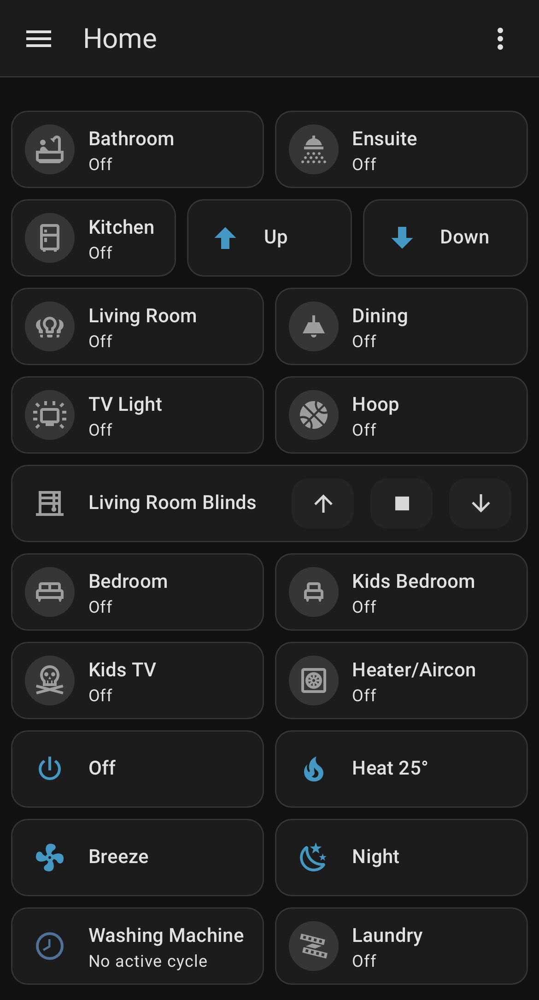
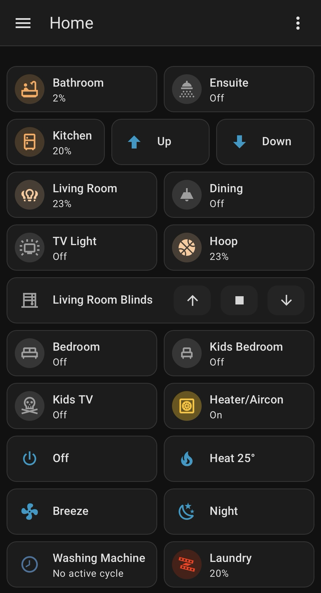

# Wright Home Assistant

This is the version-controlled portion of the Home Assistant setup running in our home.

It brings together Zigbee, Matter, Thread and Wi-Fi devices across lighting, temperature control, blinds, appliances and network recovery.

The basic approach is:

- Physical controls for most things
- Automations where they remove effort or make devices behave more intelligently
- The Home Assistant app for quick changes, detailed controls and anything less routine
- AI-first development, either directly in Home Assistant or through Git and Visual Studio Code when the configuration benefits from being readable and version controlled

This is a real, working configuration. It is not intended to be a polished set of universal templates or something another person can install unchanged.

## The setup

Home Assistant runs on a Raspberry Pi 5 with SSD storage.

The current environment includes, whatever is on special, specifically:

- IKEA Zigbee remotes, lights and outlets
- Tapo smart lighting
- Philips Hue lighting
- Matter and Thread lighting
- Tuya Zigbee blind motors
- Dyson heating and air purification
- LG washer-dryer
- Local network and internet status monitoring

Zigbee devices are managed locally through ZHA. Matter, Thread and Wi-Fi integrations are used where they make sense.

## How it works

A normal physical button should behave like a normal physical button.

For everyday tasks, nobody should need to find a phone, open an app and navigate through a dashboard just to turn on a light. Physical remotes handle the common interactions, while Home Assistant adds the logic behind them.

The app and dashboard are still useful for:

- Quick changes to configuration
- Detailed device controls
- Checking status
- Less common actions
- Managing and testing the system

Where practical, the configuration separates the trigger, the decision and the device-specific action.

For example:

1. A physical remote triggers an automation.
2. The automation decides whether the room should turn off or use its day or night behaviour.
3. A script applies the appropriate settings to the actual devices.

This means the physical interaction can stay simple even when the devices behind it are a bit weird.

## Lighting

### Day and night behaviour

The bathroom, ensuite and kitchen use shared day and night helpers.

During the day, the rooms use their normal lighting presets. At night, selected lights or lower-intensity presets are used so turning on a bathroom light does not feel like being interrogated.

The time boundaries are stored as Home Assistant helpers rather than repeated throughout the automations.

### IKEA RODRET controls

IKEA RODRET remotes control lighting in several areas.

Depending on the room, they support:

- Short press to turn lights on or off
- Short press to change brightness in steps
- Long press for continuous dimming
- Button release to stop dimming

The continuous dimming automations use restart mode so the release event can interrupt the active loop.

This works great for the IKEA Zigbee and Matter bulbs, less so for the Tapo bulbs.

### Tapo presets

Tapo handles the actual preset details for its lights.

Home Assistant decides which preset is appropriate and calls a central script to apply it. This keeps the automation logic separate from the Tapo-specific implementation. It kinda sucks. I'm looking forward to replacing the Tapo bulbs.

## Dyson control

Dyson behaviour is handled through a central controller script.

It manages:

- Power state
- Device initialisation time
- Heating mode and target temperature
- Forward and reverse airflow
- Fan presets

Smaller wrapper scripts provide straightforward actions for heating, high fan, quiet fan and power off.

This avoids repeating the same startup and sequencing logic across every dashboard action.

## Washing-machine notifications

Washing completion can be detected through either the washer status sensor or its completion event.

When a cycle finishes:

- Mobile notifications are sent.
- The laundry LED strip turns red and flashes.
- Everyone loses the ability to claim they did not know the washing was finished. It also sends annoying messages to my wife!

## Internet recovery

Home Assistant monitors the external internet connection.

If the connection remains offline for two minutes, Home Assistant power-cycles the NBN equipment through a local Zigbee outlet, waits one minute and restores power.

It does not solve every possible internet problem, but it deals with the classic “turn it off and on again” problem without requiring anyone to actually do that.

## Tuya blind support

The living-room blinds use a Tuya TS0601 chain blind motor that did not behave correctly with the default ZHA device handler.

A local, device-specific adaptation of the ZHA Tuya TS0601 cover quirk changes the device from its default smart-plug classification to the appropriate window-covering clusters.

Supported device:

- Manufacturer: `_TZE284_2gi1hy8s`
- Model: `TS0601`
- Manual model: `MB60L-ZIG-AT-TY`

The adapted quirk is stored in:

`custom_zha_quirks/tuya_mb60l_cover.py`

## Dashboard

The main dashboard is stored as YAML in:

`dashboards/our_home_v2.yaml`

It provides access to:

- Room lighting
- Brightness controls
- Living-room blinds
- Kids’ TV power
- Heating and air conditioning
- Dyson modes
- Washing-machine status
- Laundry lighting

Common actions are available directly from the dashboard. Tapping the main part of a card opens the normal Home Assistant controls when more detail is needed. It could be prettier but it is extremely functional.

## Repository structure

| Path | Contents |
|---|---|
| `configuration.yaml` | Core configuration, dashboard registration and custom ZHA quirk path |
| `automations.yaml` | Device, state, event and time-driven automations |
| `scripts.yaml` | Reusable lighting and appliance-control logic |
| `scenes.yaml` | Home Assistant scene definitions |
| `dashboards/` | YAML-managed Home Assistant dashboards |
| `custom_zha_quirks/` | Custom Zigbee device support |
| `blueprints/` | Home Assistant automation, script and template blueprints |
| `.gitignore` | Exclusions for secrets, runtime state, databases, logs and backups |

## Reusing anything from here

This configuration is specific to our home and will not work unchanged somewhere else.

Anyone borrowing an automation will generally need to replace its:

- Device IDs
- Entity IDs
- Notification targets
- Input helpers
- Light groups
- Integration-specific actions
- Tapo preset names

The patterns could still be useful even when the identifiers and devices are different.

## Security

Only configuration intended for source control is tracked.

The repository excludes:

- `secrets.yaml`
- Home Assistant authentication and runtime storage
- Databases
- Logs
- Backups
- Cloud state
- Cached dependencies
- Generated HACS content

Home Assistant device and entity registry identifiers appear in some configuration files. These identify items inside this Home Assistant installation but are not authentication credentials.

## Licence

Original work in this repository is licensed under the Apache License 2.0.

Included and adapted third-party material retains its upstream authorship and source references. See `NOTICE` for details.
